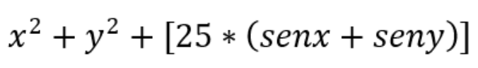

# Practice 3 - Swarm Intelligence

## 🗒️ Instrucciones

**Práctica de Inteligencia de Enjambre**

1. Realizar la **minimización** de la función en el intervalo de valores (-5,5) para (x, y) usando PSO.

2. Versión de PSO: Global
    - Número de partículas: 20
    - Iteraciones: 50
    - a= 0.4    (inercia)
    - b1= 0.7  (aprendizaje local) -> (Influencia Propia)
    - b2 = 1.2   (aprendizaje global) -> (Influencia Social)
    - Numero de vecinos: No aplica (Se hace solo con Global en la Practica)

3. En cada iteración imprimir:
    - Posición de la partícula
    - Velocidad
    - pbest
    - gbest

- Subir a Teams código del programa y realizar defensa de la práctica los días 13 y 15 de abril en el salón de clase.