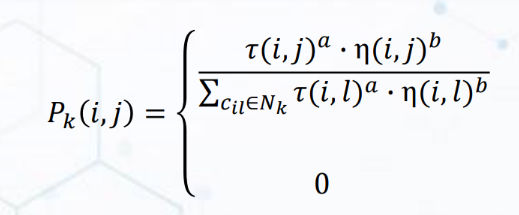
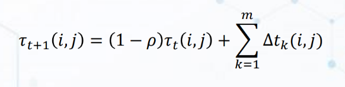
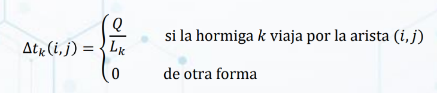

# Practice 4 - Ant Colony Optimization

## Instructions

Practice of Ant Colony

1. Sigue las intrucciones establecidas en el documento adjunto.
2. Sube el código del programa.

## Formulas

### Formula Probabilidad de Elección

### Formula Feromonas

 

 
